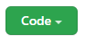
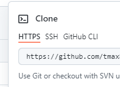
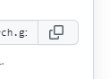

# python_august

Welcome to the lecture notes and code. To clone this repo, click the green code button above:



- Choose `HTTPS`:



- Copy the repo address to your clipboard:



- clone the repository to your machine

```bash
git clone https://github.com/tmax818/python_august.git
```

- `cd` into the new directory

```bash
cd python_august
```

- Open the directory with VScode.


# Projects

- [heroku site repo](https://github.com/tmax818/flask-ajax-322)
- [heroku site](https://flask-ajax-322.herokuapp.com/)# python_september
