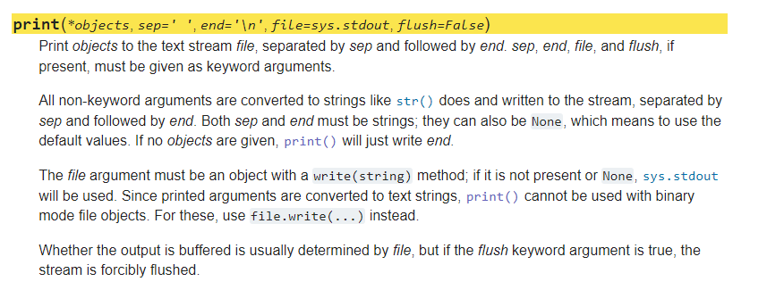

<!-- .slide:data-background="#000000" -->
# Python Fundamentals
## Fundamentals  <!-- .element: class="fragment" -->
---
# Today's Core Assignments
- For Loop Basic I  <!-- .element: class="fragment" -->
- Nested Dictionaries and Lists  <!-- .element: class="fragment" -->
---
# Recognize Python (Optional)
---
# Python Syntax
--
>Everything in Python is an object.
--
## indentation 
--
- indentation indicates which lines go with which **code block**
--
## What is a code block?
--
- code that belongs together
- indentation
--
# `pass`
--
- place holder 
--
```py
while True:
    pass
```
---
# Data Types
--
>Everything in Python is an object.
--
What is an object?
--
>An object is an instance of a class.
--
## Primitive and Composite data types
--
### Primitive Types
#### Booleans  <!-- .element: class="fragment fade-in" -->
#### Numbers  <!-- .element: class="fragment fade-in" -->
#### None  <!-- .element: class="fragment fade-in" -->
#### Strings  <!-- .element: class="fragment fade-in" -->
--
### Composite Types
#### Lists  <!-- .element: class="fragment fade-in" -->
#### Tuples  <!-- .element: class="fragment fade-in" -->
#### Dictionaries  <!-- .element: class="fragment fade-in" -->
---
# Booleans
--
> Assesses the truth value of something

```py
is_logged_in = True
is_valid_email = False
```
 <!-- .element: class="fragment fade-in" -->
---
# Numbers
--
Integers and floats(i.e. decimals)

```py
age = 35 # storing an int
weight = 160.57 # storing a float
```
<!-- .element: class="fragment fade-in" -->
---
# Strings
--
> Strings are any sequence of characters (letters, numerals, ~($/}\#, etc.) enclosed in single or double quotes.

```py
name = "Joe Blue"
```
<!-- .element: class="fragment fade-in" -->
--
## Concatenating Strings and Variables

### With the built-in "print" function <!-- .element: class="fragment fade-in" -->


<!-- .element: class="fragment fade-in" -->

--
## With String Interpolation
### F-String (Literal String Interpolation) <!-- .element: class="fragment fade-in" -->
### `string.format()`  <!-- .element: class="fragment fade-in" -->
### %-formatting  <!-- .element: class="fragment fade-in" -->
--
### F-String (Literal String Interpolation)

```py
first_name = "Zen"
last_name = "Coder"
age = 27
print(f"My name is {first_name} {last_name} and I am {age} years old.")
## => My name is Zen Coder and I am 27 years old.
```
<!-- .element: class="stretch" -->
--
### `string.format()`

```py
first_name = "Zen"
last_name = "Coder"
age = 27
print(f"My name is {} {} and I am {} years old.".format(first_name, last_name, age))
## => My name is Zen Coder and I am 27 years old.
```
<!-- .element: class="stretch" -->
--
### %-formatting

```py
first_name = "Zen"
last_name = "Coder"
age = 27
print(f"My name is %s %s and I am %d years old." % (first_name, last_name, age))
## => My name is Zen Coder and I am 27 years old.
```
<!-- .element: class="stretch" -->
---
# None
--
# None
```py
nothing = None
```

